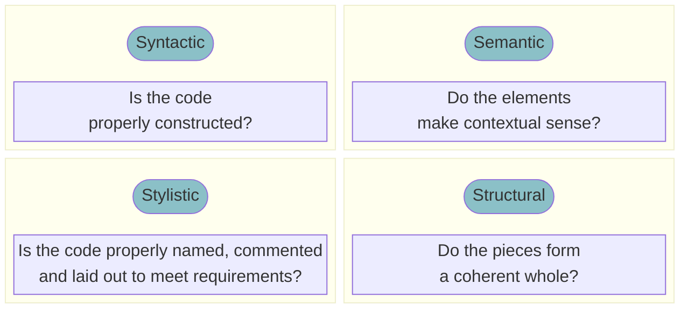

## RTL 코드에 대한 정적 분석 툴

- Identify/fix the issues as RTL is created/evolves
  - Reduces wasted iterations
  - Improves design efficiency
  - Lint is a static tool - requires no stimulus or constraints
    - Fast, requires no input apart from RTL
- Improve quality of RTL by following corporate (and industry standard) coding guidelines
- Ensure RTL is re-usable

> 테스트 벤치나 contraints 가 필요 없음
{: .prompt-tip }

## 특징

## Questa Lint WorkFlow

## Questa Lint - Types of Methodologies

> Lint 검사에 대한 표준 설정이 가능하다.
> ISO-26262, DO-254 같은 인증이 필요한 프로젝트 진행시
> 코드 리뷰 결과 산출물이 요구되는 경우 이에 적합한 다양한 코딩 룰 설정이 가능하다.
{: .prompt-tip }
